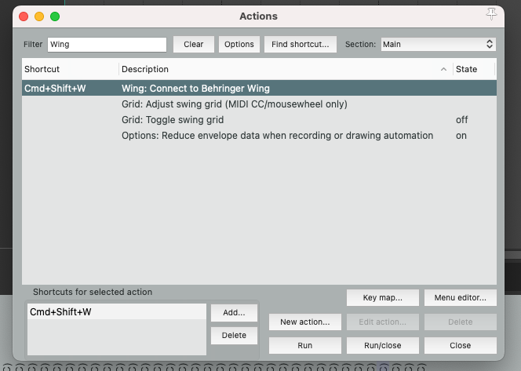
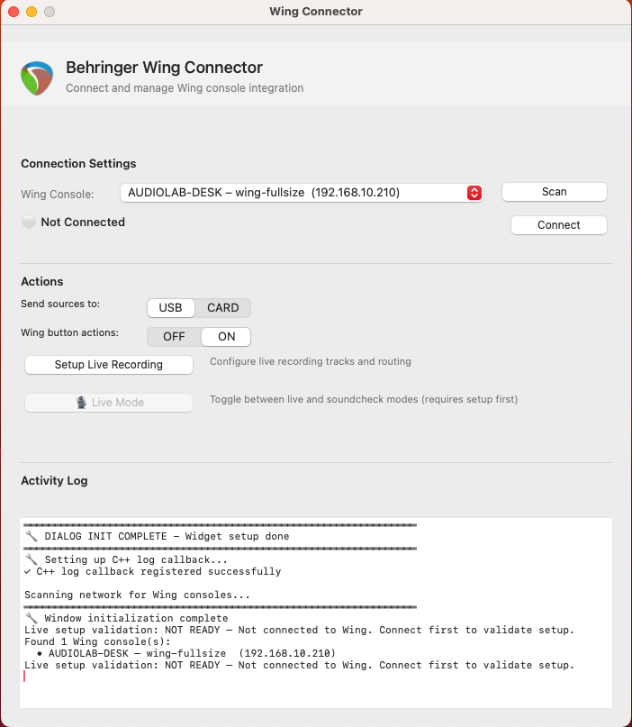
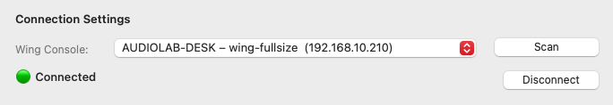
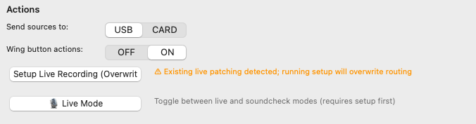

# AUDIOLAB.wing.reaper.virtualsoundcheck User Guide

Practical guide for daily operation in REAPER with a Behringer WING.

## 1. Validate Installation

1. Restart REAPER after installing AUDIOLAB.wing.reaper.virtualsoundcheck.
2. Confirm menu entry exists: `Extensions -> AUDIOLAB.wing.reaper.virtualsoundcheck`.
3. Open: `Extensions -> Behringer Wing: Configure Virtual Soundcheck/Recording`.

If the menu is missing, verify plugin files are in your REAPER `UserPlugins` folder for your OS.

## 2. Connect to WING and Fetch Channels

1. In the AUDIOLAB.wing.reaper.virtualsoundcheck dialog, use `Scan` to discover WING consoles.
2. If scan fails, enter a manual WING IP in the fallback field.
3. Start connect/fetch.
4. Wait for channel discovery and track creation/update.

Expected result:

- Connection succeeds
- Channel metadata is retrieved
- Tracks are created or refreshed in REAPER

## 3. Confirm Connected State

After a successful connect, the dialog should indicate active status and show progress/log feedback.

If connection fails:

- check WING OSC settings
- verify network path and firewall
- verify IP/port values

## 4. Use Optional Features

From the same dialog flow you can:

- refresh tracks from current WING state
- enable/disable live monitoring behavior
- configure virtual soundcheck routing
- toggle soundcheck mode (ALT source switching)

## 5. Recommended Session Workflow

1. Connect and fetch channels at session start.
2. Verify names/colors/routing in REAPER.
3. Record as usual.
4. When needed, configure virtual soundcheck and toggle mode.
5. Refresh tracks if channel metadata changes on WING.

## 6. MIDI Button Control (Automatic)

Built-in CC mapping used by AUDIOLAB.wing.reaper.virtualsoundcheck:

| CC # | Action |
|------|--------|
| 20 | Play |
| 21 | Record |
| 22 | Toggle Virtual Soundcheck |
| 23 | Stop (save recorded media) |
| 24 | Set Marker |
| 25 | Previous Marker |
| 26 | Next Marker |

Requirements:

- Message type must be `MIDI CC` (not Note On)
- MIDI channel must be channel 1
- Button press value must be `> 0`
- Enable `Assign MIDI shortcuts to REAPER` in the plugin window to push command bindings and labels to the selected WING layer automatically
- No manual action-list mapping is required for normal operation

Detailed behavior and fallback notes:

- [CC_BUTTONS_AND_AUTO_TRIGGER.md](CC_BUTTONS_AND_AUTO_TRIGGER.md)
- [snapshots/README.md](../snapshots/README.md)

## 7. Auto-Trigger (Optional)

Auto-trigger is configured in the `Auto Trigger` section of the plugin window and can run in:

- `WARNING` mode: warning state only, no transport record start
- `RECORD` mode: automatic REAPER record start/stop based on signal

Main controls:

- `Monitor track`
- `Threshold` (dBFS)
- `Hold ms`
- `CC layer` for warning/record status display on WING

Detailed reference:

- [CC_BUTTONS_AND_AUTO_TRIGGER.md](CC_BUTTONS_AND_AUTO_TRIGGER.md)

## 8. Troubleshooting

- No connection:
  - WING and computer must be on same network
  - OSC lock must be disabled on WING
  - OSC port must match plugin config
- Plugin not visible in REAPER:
  - verify plugin binary exists in `UserPlugins`
  - restart REAPER after install
- No track updates:
  - rerun channel fetch/refresh
  - verify channel source configuration on WING

## Related Docs

- [INSTALL.md](../INSTALL.md)
- [QUICKSTART.md](../QUICKSTART.md)
- [SETUP.md](../SETUP.md)
- [docs/ARCHITECTURE.md](ARCHITECTURE.md)
- [CC_BUTTONS_AND_AUTO_TRIGGER.md](CC_BUTTONS_AND_AUTO_TRIGGER.md)
